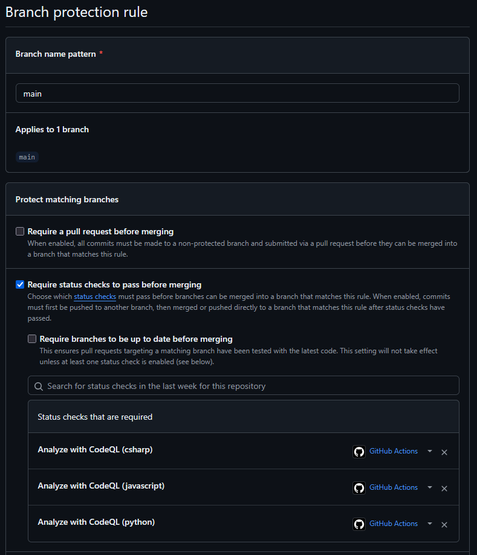
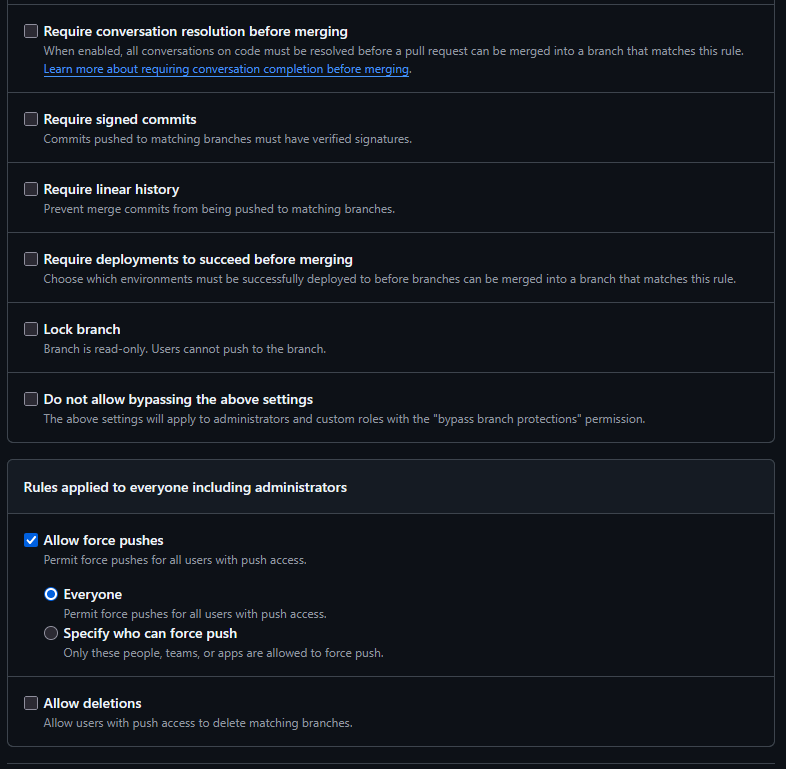

# 🗳️ Obligatorio Voting App

## 🛠️ Herramientas
- **Repositorio:** GitHub  
- **CI/CD:** GitHub Actions  
- **Análisis de código estático:** SonarQube  
- **Cloud:** AWS  
- **Infraestructura como Código (IaC):** Terraform  
- **Testing:** JMeter
- **Serverless:** Lambda 

---
## 🔐 Prerequisitos
Estas variables deben estar configuradas como *Secrets* en GitHub:

- `AWS_ACCESS_KEY_ID`
- `AWS_REGION`
- `AWS_SECRET_ACCESS_KEY`
- `AWS_SESSION_TOKEN`
- `BUCKET_NAME` (nombre único del bucket S3 en donde se guardarán los tfstates.)
- `EMAIL_USER`
- `EMAIL_PASS`
- `REPO_OWNER_MAIL`
- `SONAR_TOKEN`

Los primeros cuatro secretos corresponden a configuraciones de AWS, por lo que siempre son necesarios para poder acceder correctamente a los servicios.

El Bucket Name es necesario ya que, al ser dos personas las que estamos trabajando en el proyecto y dado que los buckets de S3 deben tener nombres únicos, no es posible utilizar un mismo nombre en cuentas diferentes. Esto fue algo que se tuvo que parametrizar (y, por lo tanto, el mismo debe ser creado manualmente **antes** de correr el pipeline).

Los secretos de Email User, Email Pass y Repo Owner Mail son necesarios para el envío de correo cuando se crea un Pull Request y cuando finaliza lambda.

El Sonar Token es necesario para la realización del análisis de código de SonarQube.


---

## 🌿 Estrategia Git Flow

La estrategia elegida fue **Git Flow**. Si bien entendemos que la estrategia **Trunk Based** tiene características útiles (promueve integración continua, especialmente útil en proyectos pequeños), decidimos utilizar **Git Flow** ya que nos permite observar más atentamente los cambios realizados a la rama principal.

Dado que todavía estamos aprendiendo cómo utilizar las tecnologías enseñadas en clase, consideramos que un monitoreo más a fondo de lo que se incorpora a la rama principal es la estrategia que más se alinea con nuestra forma de trabajo. Al utilizar esta estrategia, sabemos que lo que se integra a `main` está funcionando correctamente.

### ✅ Entornos bien definidos y separados
El proyecto tiene ramas bien diferenciadas que se alinean con Git Flow:
- `dev`: para desarrollo
- `test`: para validación antes de producción
- `main`: versión estable y en producción

### 📦 Control sobre versiones y despliegues
Git Flow permite:
- Controlar cuándo se libera una nueva versión
- Aplicar hotfixes sin afectar `dev`
- Mantener la estabilidad en `main` mientras se desarrollan nuevas funcionalidades

### 🔁 Integración con flujos CI/CD por ramas
- La app genera imágenes por rama (`dev`, `test`, `main`)
- Cada rama despliega en su entorno específico
- Git Flow encaja naturalmente con pipelines CI/CD basados en tags por rama

### 🛡️ Aislación de features y bugs
- Ramas específicas para nuevas features sin romper `dev`
- Hotfixes críticos directamente sobre `main`
- Mayor seguridad antes de llegar a producción

---


## 📁 Estrategia de Repositorio para Infraestructura

Decidimos usar **el mismo repositorio** para la carpeta de infraestructura. 

Esto nos resulta más práctico para un proyecto pequeño como este, ya que podemos realizar cambios tanto en la aplicación como en la infraestructura desde un mismo lugar. Si el proyecto fuera más grande, sí consideraríamos separar el código de infraestructura en un repositorio exclusivo para facilitar su reutilización.

---

## 🧱 Arquitectura


Componentes:
- 🐍 Front-end en [Python](/vote): permite votar entre dos opciones
- 🧠 [Redis](https://hub.docker.com/_/redis/): almacena los votos temporales
- ⚙️ [Worker en .NET](/worker): consume votos desde Redis y los guarda en...
- 🛢️ [Postgres](https://hub.docker.com/_/postgres/): base de datos persistente
- 📊 Web app [Node.js](/result): muestra resultados de la votación en tiempo real

---

## 🚀 Flow de CI/CD

1. **Push a una rama (`dev`, `test`, `main`)**
   - Se configuran credenciales AWS
   - Se crean repositorios ECR para imágenes
   - Se genera una nueva imagen Docker con tag único
   - Se sube la imagen a ECR con tag de entorno
   - Se actualiza el archivo `docker-compose.generated.yml` con el tag generado
   - El archivo `docker-compose.generated.yml` se sube a bucket S3
   - Se crea repositorio para Lambda
   - Se genera una imagen para backup utilizando Lambda
   - Se sube la imagen a ECR
   - Se crea la infraestructura común a todos los ambientes (network)
   - Se crea la infrastructura correspondiente al ambiente del push
   - Se despliegan manifiestos K8s
   - Se realiza testing de carga en ALBs creados por K8s (Vote y Result)
   - Se invoca función Lambda

   - Se envía notificación por correo electrónico

🛠️ Diagrama de Flujo - CI/CD Voting App
```text
Inicio
└── 🔹 Push a rama (dev, test, main)
    └── 🟩 Determinar entorno
        ├── dev → entorno desarrollo
        ├── test → entorno testing
        └── main → entorno producción
            └── 🟨 Login a AWS/ECR
                ├── aws ecr get-login-password
                └── docker login con el token generado
                    └── 🟧 Generar tag único
                        ├── obtener hash corto del commit (GIT_COMMIT)
                        └── Formato: voting-app:<ambiente>-<GIT_COMMIT>
                            └── 🟦 Construcción de imágenes
                                └── docker build -t voting-app:<tag> .
                                    └── 🟩 Subir imagen a ECR
                                        ├── docker tag → apuntar al repo ECR
                                        └── docker push → subir imagen
                                            └── 📝 Actualizar archivo docker-compose.generated.yml
                                                ├── reemplazar tag de imagen
                                                └── guardar archivo actualizado
                                                    └── ✅ Archivo listo para despliegue
                                                        └── imagen disponible en ECR
                                                            └── 🟨 Construcción de imagen Lambda
                                                                └── docker build -t lambda-backup ./lambda-backup
                                                                    └── 🟧 Subir imagen a ECR
                                                                        ├── docker tag → apuntar al repo ECR
                                                                        └── docker push → subir imagen
                                                                            └── 🟦 Creación de infra con Terraform
                                                                                ├── terraform init y apply: capa network
                                                                                ├── tfstate network guardado en bucket
                                                                                ├── terraform init y apply: capa ambiente actual
                                                                                └── tfstate ambiente guardado en bucket
                                                                                    └── 🟩 Despliegue de Kubernetes
                                                                                        ├── reemplazo de variables en manifiestos
                                                                                        ├── aws eks update-kubeconfig
                                                                                        └── kubectl apply -f k8s-specifications
                                                                                            └── 🔍 Realizar testing de carga
                                                                                                ├── seteo de ambiente
                                                                                                ├── corre test en ALB de Vote
                                                                                                ├── tabla de restultados
                                                                                                ├── corre test en ALB de Results
                                                                                                └── tabla de restultados
                                                                                                                       └──λ Invocar Lambda con ALBs
                                                                                                                                                  └── 📧 Email notification de lambda result
                                                                                                                                                                                          └── 📧 Email notification Resultado del Pipeline
   

```

 ## Terraform Deploy
   - La estructura de infraestructura es la siguiente
   ```text  
        infra/
            env
              |_ dev 
              |    lambda_backup.tf
              |    main.tf
              |    outputs.tf
              |    terraform.tfvars
              |    variables.tf    
              |_ test
              |    lambda_backup.tf
              |    main.tf
              |    outputs.tf
              |    terraform.tfvars
              |    variables.tf    
              |_ main
              |    lambda_backup.tf
              |    main.tf
              |    outputs.tf
              |    terraform.tfvars
              |    variables.tf
            network
                 main.tf
                 output.tf

   
```
Tomamos la decisión de esta estructura para la infraestructura por los siguientes motivos:

**Separación clara por entorno**

Cada entorno (dev, test, main) tiene su propio conjunto de archivos Terraform:
   - Permite aplicar cambios de forma independiente.
   - Reduce el riesgo de errores al evitar que cambios en desarrollo afecten producción.
   - Facilita pruebas y validaciones antes de promover cambios.
     
 **Reutilización**
 
 La carpeta network define infraestructura en común para todos los ambientes, VPC, IGW, etc. 

 **Escalabilidad**
 
 Es facilmente escalable, se puede agregar nuevos entornos sin modificar los existintes

 **Gestión de variables por entorno**

 Cada entorno tiene su propio terraform.tfvars, permite definir configuraciones específicas (nombres, tamaños, regiones, etc.) sin duplicar lógica, mejora la trazabilidad y el control de cambios.
 
 **Cumplimiento y auditoría**

 Separar entornos ayuda a cumplir con políticas de seguridad y auditoría.

 **Prácticas Devops**
 
 Se tomaron en consideración las prácticas más comunes de Devops. Cada ambiente tiene su propio cluster EKS (en vez de tener un solo cluster con tres namespaces).

---

📌 *EXTRA* Además con esta estructura podemos automatizar despliegues por entorno.

---

 ## Análisis estático 
   - Se ejecuta SonarQube en cada push para evaluar calidad de código
   - Se usa el GitHub Action oficial de SonarCloud o configuración personalizada con `sonar-scanner`
   - SonarQube permite mejorar la calidad del código automáticamente al analizarlo en busca de errores, vulnerabilidades, código duplicado y malas prácticas. Facilita el mantenimiento, reduce el riesgo de fallos en producción y promueve buenas prácticas de desarrollo mediante métricas claras e integraciones con CI/CD. Además, ayuda a asegurar que el código nuevo  no degrade la calidad existente.

   #### Prerrequisitos SonarQube:
   - Tener un proyecto creado en [SonarCloud](https://sonarcloud.io/) o en tu instancia propia de SonarQube
   - Generar un `SONAR_TOKEN` y agregarlo como *Secret* en GitHub
   - Configurar el archivo `sonar-project.properties` en la raíz del repo, por ejemplo:

     ```properties
     sonar.projectKey=nombre-del-proyecto
     sonar.organization=nombre-organizacion
     sonar.host.url=https://sonarcloud.io
     sonar.login=${SONAR_TOKEN}
     sonar.sources=.
     sonar.language=js
     sonar.sourceEncoding=UTF-8
     ```

   - Verificar que las rutas (`sonar.sources`) coincidan con el código fuente real

Infrome de sonarQube


## Testing
   - Se ejecutan pruebas de carga con JMeter sobre el entorno correspondiente

## Lambda url-checker 

Verificación de disponibilidad de servicios

Esta función Lambda fue desarrollada con el objetivo de monitorear la disponibilidad de los servicios frontend de la Voting App desplegados en AWS (por ejemplo, las aplicaciones vote y result publicadas detrás de ALBs).

 ```
/lambda
   |_lambda.zip
 ```

   
Se invoca automáticamente desde el pipeline de CI/CD en GitHub Actions, luego del despliegue de infraestructura y servicios, para verificar que las URLs estén accesibles y respondiendo correctamente.

Permite detectar errores tempranos en el pipeline si algún servicio clave no responde (503, timeout, etc.).

Facilita la automatización de health checks post-despliegue sin necesidad de herramientas externas.

Aporta visibilidad del estado real de la aplicación al finalizar el CI/CD, integrando:

Verificación HTTP de múltiples endpoints.

Alerta automática por correo en caso de falla.

Seguridad y buenas prácticas
La función está empaquetada en ZIP incluyendo la librería requests como dependencia externa.

Utiliza verify=False para ignorar certificados autofirmados durante el testeo, evitando falsos negativos en ambientes no productivos.

Responde con un JSON estructurado con los resultados individuales por URL.

La salida de la Lambda es procesada automáticamente en el pipeline.

Si alguna URL no responde con 200 OK, el workflow:

Se marca como fallido (exit 1)

Envía un correo a un destinatario configurable con detalles del error

## Notificación
   - Se envía un correo a `$REPO_OWNER_MAIL` con resultados del pipeline y link al despliegue


## 🚧 CodeQL y  super-linter como *Quality Gate* en el Proceso de Integración Continua

Este repositorio utiliza [`codeql-analysis.yml`](.github/workflows/codeql-analysis.yml) para configurar y ejecutar [CodeQL](https://codeql.github.com/), una herramienta de análisis de código estático desarrollada por GitHub, para los siguientes lenguajes 'csharp', 'javascript', 'python'. En este caso, se aplica específicamente a la aplicación `voting-app`, con el objetivo de detectar automáticamente vulnerabilidades, errores y problemas de calidad en el código de sus distintos servicios.
En este repositorio, CodeQL se utiliza como un **_quality gate_ automático** durante el proceso de integración continua. Esto garantiza que el código que se fusiona en las ramas principales (`dev`, `test` y `prod`) haya pasado un análisis de seguridad y calidad.

### 🔁 Flujo de trabajo

1. **Creación de un Pull Request hacia `dev`, `test` o `prod`**
   - Cada vez que se propone un cambio hacia alguna de estas ramas, se activa automáticamente un análisis CodeQL a través de GitHub Actions.

2. **Ejecución del análisis de seguridad**
   - CodeQL analiza el código fuente, construye una base de datos interna y ejecuta consultas para detectar:
     - Vulnerabilidades de seguridad
     - Errores de lógica
     - Problemas comunes de codificación

3. **Evaluación del resultado**
   - Si el análisis detecta alertas críticas, el workflow falla y **se bloquea el merge** hasta que se resuelvan los problemas.

4. **Merge aprobado solo si pasa el quality gate**
   - El código solo puede integrarse si pasa exitosamente el análisis CodeQL, asegurando que las ramas clave mantengan un nivel mínimo de seguridad y calidad.

### ✅ Beneficios

- 🔒 **Seguridad preventiva**: Se bloquean vulnerabilidades antes de llegar a producción.
- 📐 **Consistencia**: Se aplica el mismo estándar en todos los entornos (`dev`, `test`, `prod`).
- 🧹 **Reducción de deuda técnica**: Se previene la acumulación de errores y malas prácticas en el tiempo.
- 🚀 **Despliegues más confiables**: Cada rama mantiene un estado seguro y controlado.

---

📌 *EXTRA* Este proceso se complementa con la configuración de **branch protection rules** en GitHub, exigiendo que el análisis CodeQL se complete correctamente antes de permitir merges en las ramas protegidas.

---
Las configuraciones de las **branch protection rules** son las siguientes:





### 🧪 ¿Cómo funciona?

1. **Definición del flujo de trabajo**  
   El archivo `codeql-analysis.yml` configura la ejecución de CodeQL para los lenguajes utilizados en `voting-app` (por ejemplo, Python y JavaScript).

2. **Creación de la base de datos CodeQL**  
   Se analiza el código fuente de cada servicio y se construye una base de datos con su estructura y semántica.

3. **Ejecución de consultas**  
   Se aplican consultas predefinidas y, si es necesario, personalizadas, para identificar vulnerabilidades y errores en los servicios de la aplicación.

4. **Publicación de resultados**  
   Las alertas se muestran automáticamente en GitHub, brindando a los desarrolladores información detallada para remediarlas.

---

👉 Más información sobre CodeQL: [https://codeql.github.com/docs/](https://codeql.github.com/docs/)

---

## 📸 Tablero Kanban

### Primera etapa:


### Segunda etapa:


### Tercera etapa:


### Decisiones de Diseño

- Al utilizar el mismo repositorio en el codigo de la aplicación, como en la infraestructura, si en los pipeline (super-linter.yml o codeql-analysis.yml) el resultado es con error, como es un error de código igual se continúa con el despliegue de la infraestructura, esto sólo se aplica para el laboratorio. En el caso del laboratorio codeql-analysis, termina de forma correcta, y super-linter que hace una revision de html,css y yaml no, igual este último sólo se ejcuta cuando el branch es main.

- En aws se utiliza una sola VPC, para los 3 cluster y 2 subnets por ambiente. Para cada ambiente se tiene un cluster, algunas de las razones fueron menor "Blast Radius", si hay un error humano, una configuración errónea o un incidente de seguridad en un ambiente, el impacto se limita a ese clúster específico. Es mucho más difícil afectar accidentalmente producción desde desarrollo. Ciclo de vida y pruebas independientes, puedes probar las actualizaciones de versión de Kubernetes en un clúster de desarrollo/QA antes de aplicarlas a producción. En un solo clúster, actualizar la versión del Kubernetes afectaría a todos los ambientes simultáneamente. Configuraciones de infraestructura específicas, cada clúster puede tener configuraciones de red, almacenamiento, balanceadores de carga o tipos de instancias subyacentes optimizadas para las necesidades específicas de ese ambiente (ej: menor costo en dev, alta disponibilidad y performance en prod).

- 
